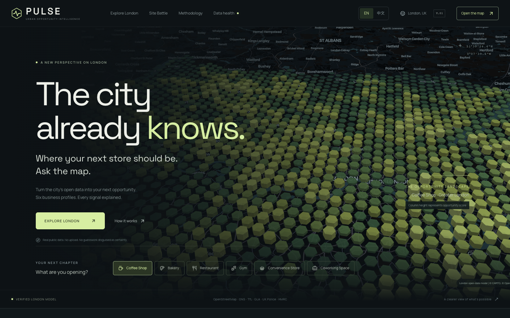
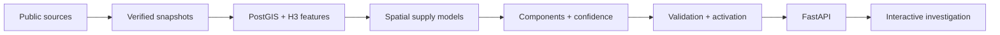

<div align="center">

# PULSE

### Urban Opportunity Intelligence

**The city already knows where your next store should be. Ask the map.**

London location intelligence, built from real public data and explainable spatial models.

[](https://github.com/kyky2347/project-oa90ug6m/actions/workflows/ci.yml)
[](LICENSE)
[](https://github.com/kyky2347/project-oa90ug6m/releases)

[Product tour](docs/product-tour.md) · [Run locally](#run-locally) · [How it works](#from-public-data-to-a-location-hypothesis) · [Documentation](docs/README.md) · [简体中文](README.zh-CN.md)

</div>



PULSE helps you decide **which areas deserve a closer look before opening a business**. Choose a coffee shop, bakery, restaurant, gym, convenience store or coworking space; explore the city; inspect the evidence; and compare a shortlist.

The central question is whether an area's mapped supply looks low relative to the demand and context observed in similar areas. PULSE turns that question into a spatial model, six inspectable score components and an interactive investigation workflow. It supports location screening; it does not predict revenue or guarantee commercial success.

## See the product


**Start with a signal. Finish with the evidence.** The map leads into an area dossier with source dates, confidence, weighted contributions, mapped venues and catchment context. Business profiles and custom weights change the question being asked; the backend remains the single scoring authority.

|                                                            Compare two areas                                                            |                                                      Explore transport patterns                                                      |
| :-------------------------------------------------------------------------------------------------------------------------------------: | :----------------------------------------------------------------------------------------------------------------------------------: |
| [](docs/product-tour.md#3-compare-two-areas) | [](docs/product-tour.md#4-examine-the-typical-day) |
|                                          Component tradeoffs, confidence and CSV/JSON export.                                           |                                         Weekday, Saturday and Sunday quarter-hour profiles.                                          |

[Take the full product tour →](docs/product-tour.md) Includes catchments, source health, methodology and mobile views. These are captures of the running application using the recorded London dataset. The interactive application runs locally; a hosted analytics backend is not provided.

The interface supports **English and Simplified Chinese**. Switch with **EN / 中文** in the header; the preference persists without changing scores or investigation state. [中文界面与说明 →](README.zh-CN.md)

## What makes PULSE distinctive

| Design choice                  | Why it matters                                                                                                                                                          |
| ------------------------------ | ----------------------------------------------------------------------------------------------------------------------------------------------------------------------- |
| **Modelled white space**       | Poisson / Negative Binomial models compare expected supply with mapped supply, accounting for count variance. An empty area alone is not evidence of opportunity.       |
| **Spatial validation**         | Four geographic folds, an 800m exclusion buffer and training-only preprocessing reduce leakage from neighbouring areas. Every model is compared with a simple baseline. |
| **Confidence-adjusted scores** | Data quality draws uncertain scores toward a neutral 50. Confidence is inspectable and is a quality index, not a probability of success.                                |
| **One evidence chain**         | Source receipts → immutable snapshots → H3 features → model versions → canonical API scores → interface explanations.                                                   |
| **Safe refreshes**             | A candidate must pass geometry, coverage, conservation and score-drift gates before atomic activation. A failed refresh retains the working version.                    |

## Run locally

Install **Git and Docker with Compose**. On macOS, use OrbStack or Docker Desktop; on Linux, start Docker Engine first. On Windows, use a WSL2 terminal with Docker integration. macOS has been exercised locally and Linux is covered by CI; Windows/WSL2 has not been verified.

```sh
git clone https://github.com/kyky2347/project-oa90ug6m.git pulse
cd pulse
./scripts/pulse
```

The launcher builds missing images, starts PostGIS and Redis, acquires and validates real data when the warehouse is empty, then starts the API, web app and daily refresh worker. It waits for application health before opening **[localhost:3000](http://localhost:3000)**. API documentation is at **[localhost:8000/docs](http://localhost:8000/docs)**.

The first run needs internet access and can take a while, especially for Police data and container downloads. Keep the terminal open until startup succeeds. Later runs reuse verified data and run services in the background. No account, proprietary dataset, manual upload or AI API key is required.

```sh
./scripts/pulse stop         # stop services; keep all data
./scripts/pulse status       # inspect the five services
./scripts/pulse data-status  # active model and source snapshots
./scripts/pulse validate     # check the active warehouse
./scripts/pulse refresh      # check due sources and safely update
./scripts/pulse logs         # follow logs; Ctrl-C leaves services running
./scripts/pulse --build      # rebuild application images after code changes
```

Prefer downloading a ZIP? Use the [versioned release](https://github.com/kyky2347/project-oa90ug6m/releases), extract it and run `bash scripts/pulse` from its root. See [setup, global `pulse` shortcut and troubleshooting](docs/quickstart.md), [development](CONTRIBUTING.md) and [reproduction boundaries](docs/reproducibility.md).

## The recorded London edition

The following describes the **11 September 2026 verification run**, not a continuously updated claim about today's data. Fresh builds discover publisher releases and may produce different versions and rankings.

| Coverage                                 | Recorded result |
| ---------------------------------------- | --------------: |
| London boroughs / LSOAs                  |      33 / 4,994 |
| H3 resolution 8 / resolution 9 cells     |  2,579 / 17,340 |
| Business profiles / fitted supply models |          6 / 12 |
| Business–cell opportunity scores         |         119,514 |
| Verified source adapters                 |               7 |

| Source                    | Evidence used                              | Interpretation                                        |
| ------------------------- | ------------------------------------------ | ----------------------------------------------------- |
| ONS / Nomis               | Mid-2024 residents; Census 2021 households | Resident demand proxies                               |
| ONS / GLA geography       | 2021 LSOA boundaries                       | Common spatial allocation                             |
| OpenStreetMap / Geofabrik | 10 September 2026 extract                  | Mapped venues and surroundings                        |
| TfL NUMBAT                | Typical autumn 2025, released in 2026      | Historical typical-day transport flows                |
| UK Police                 | May–July 2026 incidents                    | Aggregated operational context; approximate locations |
| VOA / HMRC                | 31 March 2026 rating-stock bands           | Borough cost pressure; **not rent**                   |
| GLA high streets          | Retrieved 11 September 2026                | High-street context; reference date unknown           |

Exact URLs, dates, checksums and model metrics: [source catalogue](docs/data-sources.md), [release manifest](docs/release-data.json) and [snapshot receipts](data/manifests). Raw downloads and the database are acquired locally and are excluded from Git.

## From public data to a location hypothesis



The canonical score is:

```text
Opportunity = 50 + confidence × (Σ weight × component − 50)
```

The six components are **Demand Potential, Access, White Space, Ecosystem, Cost Efficiency and Operational Context**. Weights sum to one. Confidence ranges from zero to one. Explanations decompose the actual weighted calculation; no external language model generates analytical claims.

The model learns patterns in mapped supply. Its validation measures held-out supply prediction, not business success. Eleven of the twelve recorded models improve on their mean-supply baseline by spatial CV MAE; the detailed coworking model does not. [Inspect every model and its baseline](docs/completion-report.md#active-supply-models).

## Engineering and verification

| Layer             | Implementation                                                  |
| ----------------- | --------------------------------------------------------------- |
| Product           | Next.js, React, TypeScript, MapLibre, deck.gl, Tailwind, shadcn |
| API               | FastAPI, Pydantic, version-aware Redis caching                  |
| Spatial warehouse | PostgreSQL 16, PostGIS, H3 resolutions 8 and 9                  |
| Data and models   | Python, GeoPandas, osmium, statsmodels, scikit-learn            |
| Delivery          | Locked uv/pnpm dependencies, Docker Compose, GitHub Actions     |

The recorded verification includes **56 Python tests** (35 offline and 21 real-warehouse cases), **7 frontend tests**, **4 real-London browser tests** and **1 browser smoke test**, plus lint, type checks and production builds. The bilingual public release adds 7 language tests and Chinese browser coverage; see [public release checks](docs/public-release-checks.md). [Current CI](https://github.com/kyky2347/project-oa90ug6m/actions/workflows/ci.yml) runs from a clean checkout with small fixtures; full London integration remains a separate data-dependent check.

Measured locally with warm database pages and 15 warm response-cache requests, the city overview had a **28.21ms p95** and site detail **3.47ms p95**. These are development-machine observations. Software WebGL playback averaged 6.12 animation-frame callbacks/second, so this release does not claim smooth 60fps on all hardware. [Measurement conditions and raw results](docs/performance.md).

```text
apps/web          Product interface and browser tests
apps/api          Canonical scoring API and spatial evidence
pipeline/sources  Seven adapters, download contracts and provenance
pipeline/features H3 allocation, features and activation gates
pipeline/models   Count models and spatial validation
packages/scoring  Shared canonical scoring implementation
infra/postgres    Schema, spatial indexes and database checks
tests             Source fixtures, invariants and integration tests
docs              Product tour, methodology and recorded evidence
```

## Scope and responsible interpretation

London only. PULSE screens areas; it does not identify available premises, estimate lease terms or forecast sales. OSM coverage is incomplete. Residents are not customers, rateable value is not rent, and TfL typical-day estimates are not live footfall. Catchments are radial distance proxies and can cross rivers or railways. Police locations are approximate. Protected demographic attributes are not used in scoring.

These limits are part of the interface and [methodology](docs/methodology-limitations.md). Production hosting additionally needs appropriate access controls, TLS, backups and monitoring; see [deployment](docs/deployment.md).

## Explore further

[Documentation index](docs/README.md) · [Product tour](docs/product-tour.md) · [Reproduce a run](docs/reproducibility.md) · [Contribute](CONTRIBUTING.md) · [Changelog](CHANGELOG.md) · [Security](SECURITY.md)

Code is [MIT licensed](LICENSE). Data retains its [publisher's terms](docs/data-licenses.md). © OpenStreetMap contributors. Contains public sector information licensed under the Open Government Licence v3.0. TfL data is subject to its transport data terms.
