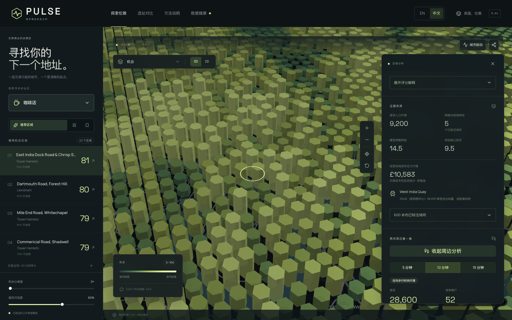

# PULSE · 城市商业机会分析

**The city already knows where your next store should be. Ask the map.**

用真实公开数据与可解释的空间模型，帮助你筛选伦敦值得进一步考察的商业区域。

[English](README.md) · [产品导览](docs/product-tour.md) · [文档目录](docs/README.md) · [版本下载](https://github.com/kyky2347/project-oa90ug6m/releases) · [持续集成](https://github.com/kyky2347/project-oa90ug6m/actions/workflows/ci.yml)


## 它解决什么问题

开店选址的第一步，是找到值得实地调查的区域。PULSE 将居民、交通、已标注商户、商业配套、成本压力与运营环境放到共同的空间网格中，比较一个区域的实际商户供给与模型预期供给，再展示分数背后的证据。

支持咖啡店、面包店、餐厅、健身房、便利店与联合办公六种业态。你可以探索 3D/2D 地图、调整权重、查看数据可信度、保存候选区域、比较两个地点并导出结果。它用于区域初筛，不预测营收，也不承诺经营成功。



## 产品体验

| 工作环节 | 功能                                                   |
| -------- | ------------------------------------------------------ |
| 探索     | 伦敦全域 H3 地图、六种业态、分数与可信度筛选、组件图层 |
| 解释     | 六项分数组成、权重贡献、来源日期、周边商户与证据说明   |
| 比较     | Site Battle 双区域对比、权衡说明、CSV/JSON 导出        |
| 时间     | City Pulse 工作日、周六、周日的典型交通活动回放        |
| 考察     | 5/10/15 分钟径向距离代理、居民与商户背景、候选清单     |
| 核验     | 数据健康、方法说明、来源、版本、模型基线与限制         |

[查看完整截图导览 →](docs/product-tour.md) 截图来自实际运行的应用与已记录的伦敦数据版本。交互式完整应用需要本地启动，仓库没有提供公开托管的分析后端。

界面右上角的 **EN / 中文** 可即时切换语言，并记住选择。地图筛选、区域详情、对比、数据健康与方法页面都支持中文，切换不改变评分或当前选址状态。

## 下载并运行

需要 Git 与支持 Compose 的 Docker。macOS 可使用 OrbStack 或 Docker Desktop；Linux 先启动 Docker Engine；Windows 可在启用 Docker 集成的 WSL2 终端中尝试。已验证 macOS 本地环境和 Linux CI，尚未验证 Windows/WSL2。

```sh
git clone https://github.com/kyky2347/project-oa90ug6m.git pulse
cd pulse
./scripts/pulse
```

也可以下载 [Release 源码 ZIP](https://github.com/kyky2347/project-oa90ug6m/releases)，解压后在项目根目录执行 `bash scripts/pulse`。

启动器会构建缺失的镜像，启动 PostGIS 和 Redis，在数据库为空时下载并验证真实公开数据、建立模型，然后启动 API、网页和每日更新服务。健康检查通过后打开 [localhost:3000](http://localhost:3000)；接口文档位于 [localhost:8000/docs](http://localhost:8000/docs)。

首次运行需要网络，镜像与 Police 数据下载可能较慢，请等待成功提示。之后启动复用已验证数据，服务在后台运行，可以关闭终端。无需账号、手动上传文件、商业数据订阅或 AI API Key。

```sh
./scripts/pulse stop         # 停止服务，保留数据库与下载数据
./scripts/pulse status       # 查看五个服务的状态
./scripts/pulse data-status  # 查看数据快照和活动模型
./scripts/pulse validate     # 校验当前数据版本
./scripts/pulse refresh      # 按更新周期检查来源并安全更新
./scripts/pulse logs         # 查看日志；Ctrl-C 只退出日志
./scripts/pulse --build      # 代码更新后重新构建镜像
```

将 `scripts/pulse` 链接到 PATH 中的目录后，可从任意位置直接输入 `pulse`。详见[启动与排错指南](docs/quickstart.md)。开发模式、依赖安装和测试命令见[贡献指南](CONTRIBUTING.md)。

## 方法特色

- **供给缺口建模：** 通过 Poisson / Negative Binomial 计数模型比较预期供给与已标注商户，避免把“商户少”直接理解成“机会大”。
- **空间交叉验证：** 四个地理分区、800 米隔离缓冲带、仅在训练集拟合预处理，并与简单基线比较。
- **可信度修正：** 数据质量较低时，机会分向中性值 50 收缩；可信度是质量指标，不是成功概率。
- **完整证据链：** 下载回执、校验和、来源快照、H3 特征、模型版本、API 分数与界面解释可以对应追溯。
- **安全更新：** 新版本通过几何、覆盖、人口守恒和评分漂移检查后才激活；失败保留原有可用版本。

```text
Opportunity = 50 + confidence × (Σ weight × component − 50)
```

六项组件为需求潜力、交通可达性、供给缺口、商业生态、成本效率和运营环境。前端不独立计算正式分数，解释来自后端实际分数贡献。

## 已记录的数据与验证

**以下是 2026 年 9 月 11 日验证版本的结果，不代表此后的实时数据。** 新安装会发现上游可用发布，快照、可信度与排名可能变化。

| 项目         | 已记录结果                                                                    |
| ------------ | ----------------------------------------------------------------------------- |
| 空间范围     | 33 个伦敦行政区、4,994 个 LSOA                                                |
| 分析网格     | 2,579 个 H3-8 单元、17,340 个 H3-9 单元                                       |
| 模型与评分   | 6 种业态、12 个供给模型、119,514 条业态–网格分数                              |
| 数据来源     | ONS/Nomis、ONS/GLA 地理边界、OSM/Geofabrik、TfL、Police、VOA/HMRC、GLA 商业街 |
| Python       | 35 个离线测试 + 21 个真实数据库集成测试                                       |
| 前端与浏览器 | 7 个单元测试、4 个真实伦敦端到端测试、1 个浏览器冒烟测试                      |

人口参考期为 2024 年中，住户数据为 2021 年人口普查；OSM 提取日期为 2026 年 9 月 10 日；TfL 为 2025 年秋季典型日估计；Police 为 2026 年 5–7 月；VOA 为 2026 年 3 月 31 日统计；GLA 商业街参考日期未知并在可信度中折减。详见[来源目录](docs/data-sources.md)和[机器可读版本记录](docs/release-data.json)。

12 个模型中，11 个在空间验证 MAE 上优于均值基线，细粒度联合办公模型未超过基线。模型预测的是已标注商户数量模式，不是经营成功。实测性能、测试环境和限制保留在[验证报告](docs/completion-report.md)与[性能记录](docs/performance.md)中。

## 复现与使用边界

仓库包含代码、锁文件、少量测试夹具、公开来源清单和截图；不包含完整原始数据或数据库。首次运行重建的是当时可获取的数据版本。精确重建历史结果还需要保留原始快照、数据库备份、对应代码和原始可信度参考时间，详见[复现说明](docs/reproducibility.md)。

仅支持伦敦区域初筛。OSM 覆盖不完整；居民数量不等于客户数量；rateable value 不等于租金；TfL 典型日数据不等于实时客流；Police 坐标经过近似化；步行圈是径向距离代理，可能跨越河流和铁路。评分不使用受保护人口属性。生产环境还需配置访问控制、TLS、备份和监控。

代码使用 [MIT 许可证](LICENSE)，数据遵循[原发布者条款](docs/data-licenses.md)。© OpenStreetMap contributors。包含 Open Government Licence v3.0 授权的公共部门信息。TfL 数据适用其交通数据条款。
