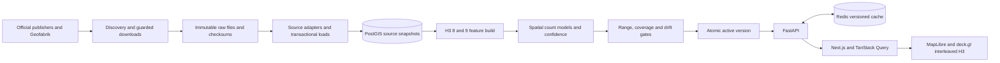

# Architecture

PULSE is a London-only screening system. Next.js presents evidence; FastAPI owns scoring and spatial queries; PostGIS is canonical; Redis is disposable. All production results originate in verified public snapshots.

`pipeline/sources` isolates discovery and ingestion; `pipeline/features` performs British National Grid spatial allocation; `pipeline/models` fits count models. `packages/scoring` is the canonical scoring implementation. `apps/api` provides query validation, caching, provenance and spatial evidence. `apps/web` provides all eight route patterns, browser state and visualisation. `infra/postgres/001_schema.sql` is an idempotent initial schema.

Source rows are keyed by snapshot ID. A new snapshot is inserted and validated within a transaction. Features, component scores, model parameters and time profiles are keyed by feature version. Activation uses a PostgreSQL advisory lock and transaction. A failed candidate never replaces the active version. Raw files and retired versions are retained for rollback. Scheduled work uses a separate worker with a PostgreSQL session lock; Redis provides a secondary coordination lock.

Public clients cannot run arbitrary SQL or submit files. Administrative endpoints require a configured token and are disabled by default. API errors identify unavailable evidence instead of inventing values. No external model service is involved in explanations: prose is assembled from the exact weighted contributions.

## Routes

`/` landing; `/explore` interactive map; `/site/[h3]` shareable site; `/compare` Site Battle; `/methodology`; `/data`; `/about`; custom not-found page. API documentation is generated at `/docs` on port 8000. The Next `/api/*` rewrite keeps browser requests same-origin.

## Deliberate boundaries

No national expansion, lease listings, revenue predictions, paid mobility, private HSDS or protected demographic targeting. Basemap tiles come from CARTO and OpenStreetMap and require network access; the verified H3 data remains usable if basemap retrieval fails. Local assets include bundled fonts; there is no user upload step.
