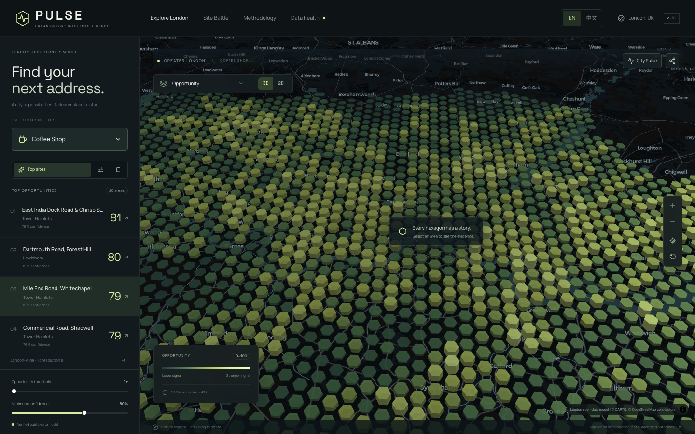
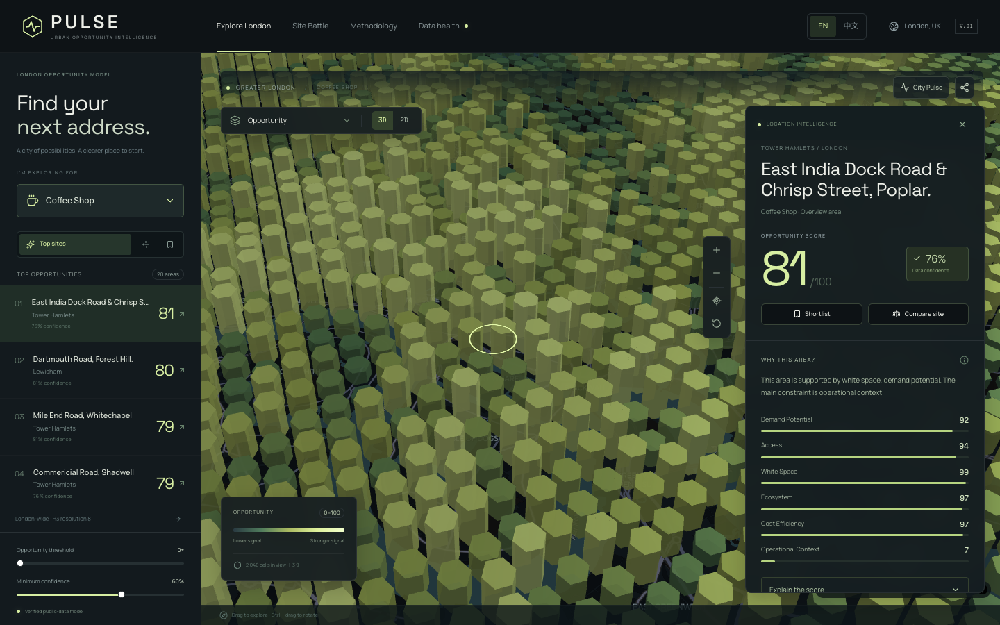
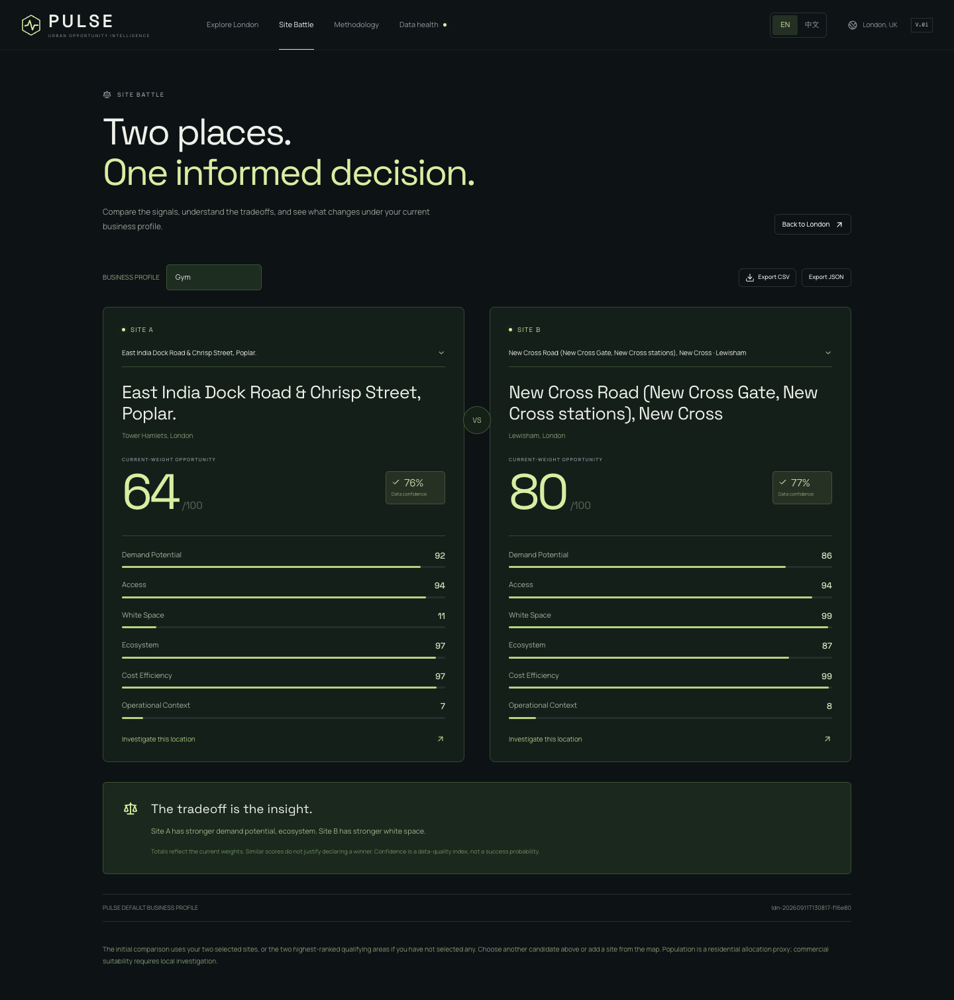
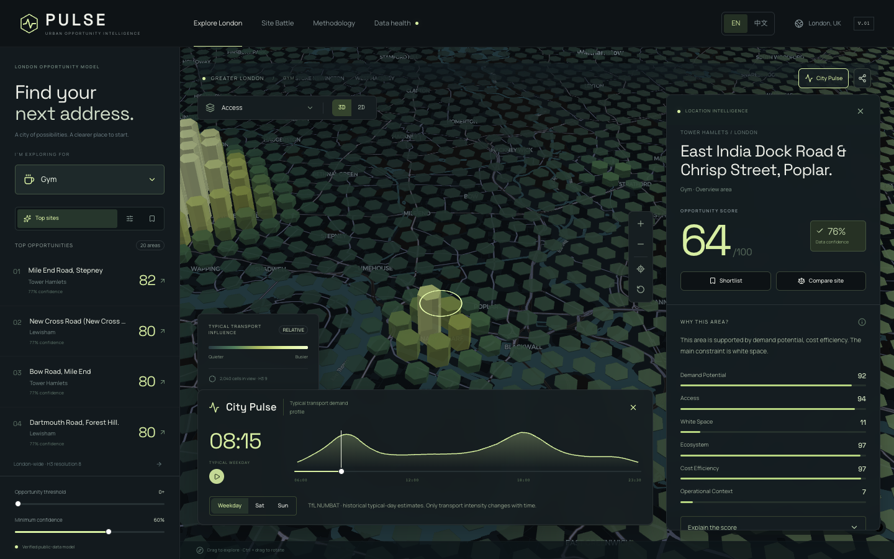
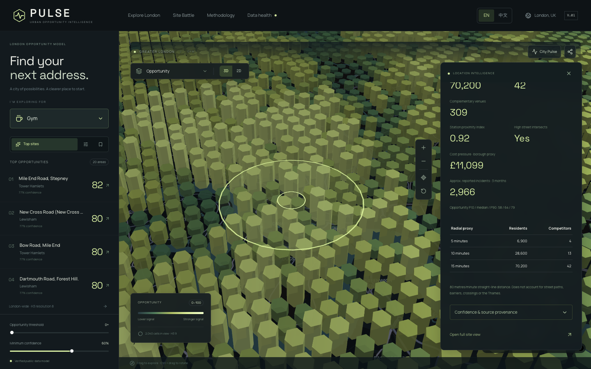
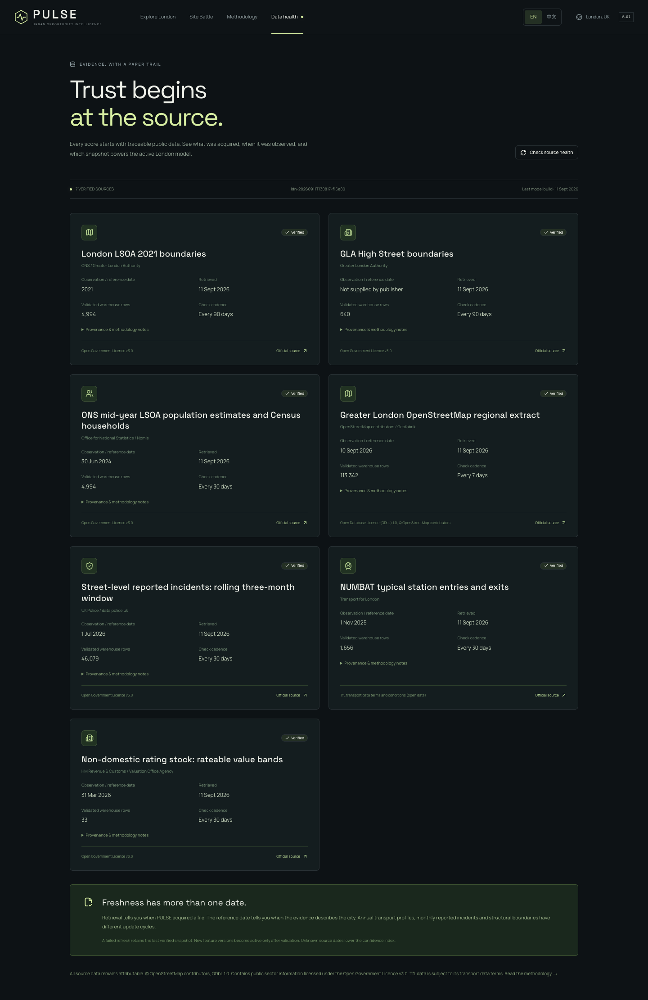
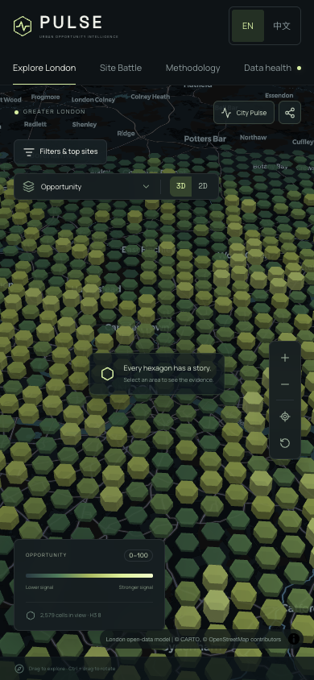
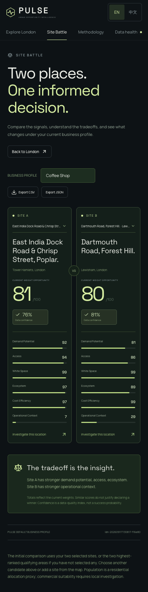
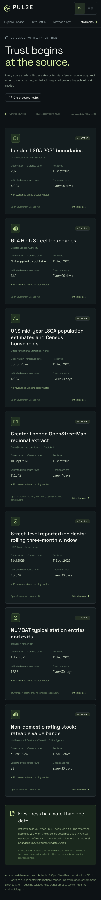

# A location decision, from signal to evidence

[Project home](../README.md) · [Run the application](quickstart.md) · [简体中文](../README.zh-CN.md)

This tour uses captures from the running September 2026 London edition. All opportunity scores come from its recorded feature version, `ldn-20260911T130817-f16e80`. The screenshots let you inspect the product without downloading the warehouse. To use the interactive controls, [start the local application](quickstart.md).

## 1. Read the city

Choose a business profile and explore the H3 landscape. Switch between opportunity and individual components, move between 3D and 2D, or filter by score and data confidence. The overview uses H3 resolution 8; zooming into an area loads resolution 9.

**Try it locally:** open Explore London, choose Coffee Shop, then select a ranked area. Switching to Gym changes the business question and the canonical API result.

## 2. Look beneath the score

The area dossier combines the overall score, confidence, six components and their weighted contributions. Open the evidence sections to inspect expected versus mapped supply, local context, model validation and source versions.

A high score is a hypothesis for investigation. A quality index of 76% does not mean a 76% chance of success. Location labels identify areas rather than available commercial units.

## 3. Compare two areas

Add two areas to Site Battle. Compare component tradeoffs under the same current business profile and weights. CSV and JSON exports retain the comparison evidence and feature version.

**Try it locally:** select Compare site on each area, open Site Battle, change the profile and export the comparison. If you arrive without two selections, the page explicitly uses the two highest-ranked qualifying areas.

## 4. Examine the typical day

City Pulse plays quarter-hour transport influence for a weekday, Saturday or Sunday. Changing the time changes transport intensity; the other underlying components remain fixed.

These are TfL NUMBAT historical typical-day estimates, not a live footfall feed. The displayed influence also incorporates distance decay and is not a count of unique customers.

## 5. Investigate the surroundings

Inspect 5, 10 and 15-minute radial catchment proxies, allocated residents, mapped competitors, complementary venues and the local score distribution.

The calculation uses 80 metres per minute in a straight line. It can cross barriers and should not be interpreted as a street-network isochrone.

## 6. Check the source before trusting the signal

Data Health distinguishes reference dates from retrieval dates and makes unavailable, stale or failed evidence visible. Methodology describes the score, assumptions and limitations.

[Read the full source catalogue](data-sources.md) or [inspect the model validation](completion-report.md#active-supply-models).

## 7. Continue on a smaller screen

The responsive interface uses a filter drawer and scrollable evidence panels. Shortlists persist on the current device. Shared URLs restore supported profile, weight, selection and camera state.

|                      Explore                      |                          Compare                          |                    Inspect provenance                     |
| :-----------------------------------------------: | :-------------------------------------------------------: | :-------------------------------------------------------: |
|  |  |  |

The header language control switches English and Simplified Chinese, including the investigation tools and methodology. Geographic names, publisher names, dataset identifiers and map-provider labels retain their source spelling.

[Run PULSE →](quickstart.md) · [Understand the methodology →](methodology-limitations.md)
